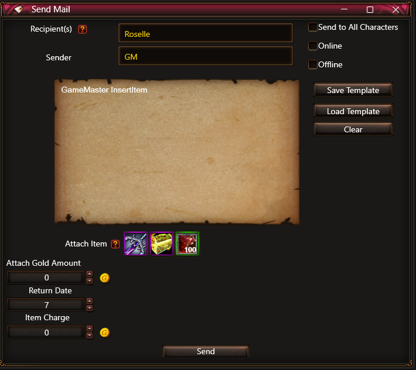

# Rusty Hearts Toolkit

  
  

## Overview

**Rusty Hearts Toolkit** is a comprehensive suite of graphical tools created for in-depth editing of *Rusty Hearts* game files and databases, enabling users to manage and customize various in-game elements efficiently.

## Getting Started

To start using Rusty Hearts Toolkit, download the latest release from the [GitHub repository](https://github.com/JuniorDark/RustyHearts-Toolkit/releases/latest).

## Features

### Database Editing Tools
- **Character Edit Tools**: Customize character attributes, including equipment, inventory, storage, fortune, sanctions, and titles.
- **Coupon Generator**: Generate unique in-game coupon codes for redeemable items rewards.
- **Send Mail**: Send in-game mail with customizable item attachments. Save mail as templates in JSON format for easy reuse.

### PCK Tools
- **PCK Tools**: A specialized tool designed for working with [.pck](https://juniordark.gitbook.io/rusty-hearts-files-structures/external-files/pck-file) files, which are the primary container format for Rusty Hearts, containing almost all of the asset files for the game.
- Read and unpack `.pck` files to extract game assets.
- Pack and write assets back into `.pck` files.

### File Editor Tools
- **WData Editor**: A specialized tool designed for editing [.wdata](https://juniordark.gitbook.io/rusty-hearts-files-structures/wdata-file) files, which are binary containers that encapsulate all runtime data for a map, packaging map resources and configurations into a single versioned file.

### Table Editor Tools
- **Table Editor**: Edit [.rh](https://juniordark.gitbook.io/rusty-hearts-files-structures/internal-files/rh-file) table files directly, with options to export into various formats like XML, XLSX, and MIP.
  
- **Dedicated Table Editors**:
  - **AddEffect Editor**: Edit buffs and effects (addeffect.rh).
  - **Cash Shop Editor**: Edit in-game cash shop items (cashshoplist.rh).
  - **Enemy Editor**: Edit enemy stats, attributes, and more (enemy.rh).
  - **Item Editor**: Edit item lists, including armor, costumes, and weapons (itemlist.rh, itemlist_armor.rh, itemlist_costume.rh, itemlist_weapon.rh).
  - **Item Drop Group Editor**: Edit item drop rates and groups across multiple files (itemdropgrouplist_f.rh, itemdropgrouplist.rh, championitemdropgrouplist.rh, eventworlditemdropgrouplist.rh, instanceitemdropgrouplist.rh, questitemdropgrouplist.rh, worldinstanceitemdropgrouplist.rh, worlditemdropgrouplist.rh, worlditemdropgrouplist_fatigue.rh, riddleboxdropgrouplist.rh, rarecarddropgrouplist.rh, rarecardrewarditemlist.rh).
  - **NPC Editor**: Edit NPC data (npcinstance.rh).
  - **NPC Shop Editor**: Edit NPC shop inventories, item crafting lists (itemmix.rh, costumemix.rh), shop visibility filters, and item dismantling rules (itembroken.rh).
  - **Package Editor**: Edit item packages and define package-specific effects (unionpackage.rh, conditionselectitem.rh).
  - **Pet Editor**: Edit pet characteristics (pet.rh).
  - **Quest Editor**: Edit quests requirements, rewards, and objectives.
  - **Random Rune Editor**: Edit 'gacha' style items pools (randomrune.rh).
  - **Set Editor**: Edit item sets and their effects (setitem.rh).
  - **Skill Editor**: Edit and configure character skills.
  - **Title Editor**: Edit titles and title effects (charactertitle.rh).
  - **World Editor**: Edit world data (world.rh, dungeoninfolist.rh, mapselect_curtis.rh).

### Local Databases
- **Item Database** 
- **Item Craft Database**
- **Item DropGroup Database**
- **Skill Database** 

## Preview

  
Click to expand preview images

  
  
  
  
  
  
  
  
  
  
  
  
  

### Language Settings

The Rusty Hearts Toolkit curently supports 2 languages, the language can be changed in the `Settings` page.

#### Available Languages
- **English (en-US)** - Default language
- **Korean (ko-KR)** - Machine translated

## Setup Guide

To set up the toolkit and generate the necessary SQLite database:

1. Navigate to the `SQLite Database Manager` page.
2. Select the `table` folder containing the `.rh` table files.
3. Click `Create Database` to generate the `gmdb_(Lang).db` database in the `Resources` folder.
4. Place the extracted game sprites `\ui\sprite\` in the `Resources` folder (Included by default).
5. Navigate to the `Settings` page and set the `SQL Server` credentials.

Note: After editing tables remember to rebuild the sqlite database on `SQLite Database Manager`.

Sprites are avaliable on [`Resources.zip`](Resources.zip)

## Prerequisites for Development
* Visual Studio 2022 (Any Edition - 17.12 or later)
* Windows 10 SDK or Windows 11 SDK via Visual Studio Installer
* .NET Core 9 SDK (9.0.100 or later)

## Building

If you wish to build the project yourself, follow these steps:

### Step 1

Install the [.NET 9.0 (or higher) SDK](https://dotnet.microsoft.com/download/dotnet/9.0).
Make sure your SDK version is higher or equal to the required version specified. 

### Step 2

Either use `git clone https://github.com/JuniorDark/RustyHearts-Toolkit` on the command line to clone the repository or use Code --> Download zip button to get the files.

### Step 3

To build Rusty Hearts Toolkit, open a command prompt inside the project directory.
You can quickly access it on Windows by holding shift in File Explorer, then right clicking and selecting `Open command window here`.
Then type the following command: `dotnet build -c Release` or using `dotnet cake` script.
 
The built files will be found in the newly created `bin` build directory.

## License

This project is licensed under the BSD 2-Clause License. See the [`LICENSE`](LICENSE.txt) file for details.

## Credits

This project is possible due to the following NuGet packages:

- [CommunityToolkit.Mvvm](https://www.nuget.org/packages/CommunityToolkit.Mvvm)
- [EPPlus](https://www.nuget.org/packages/EPPlus)
- [Microsoft.Data.SqlClient](https://www.nuget.org/packages/Microsoft.Data.SqlClient)
- [Microsoft.Extensions.DependencyInjection](https://www.nuget.org/packages/Microsoft.Extensions.DependencyInjection)
- [Microsoft.Extensions.Hosting](https://www.nuget.org/packages/Microsoft.Extensions.Hosting)
- [Microsoft.Xaml.Behaviors.Wpf](https://www.nuget.org/packages/Microsoft.Xaml.Behaviors.Wpf)
- [Newtonsoft.Json](https://www.nuget.org/packages/Newtonsoft.Json)
- [System.Data.SQLite.Core](https://www.nuget.org/packages/System.Data.SQLite.Core)
- [WPF-UI](https://www.nuget.org/packages/WPF-UI/)
